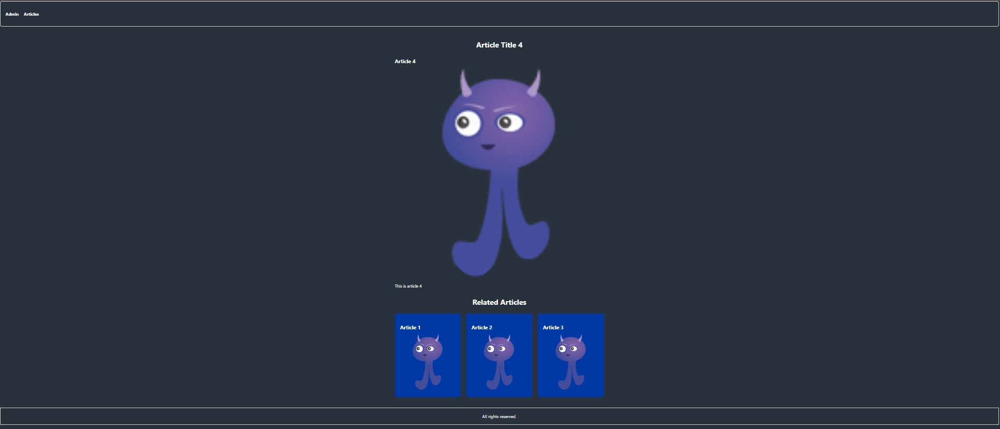

# CMS for Articles

This is a Content Management System (CMS) for articles. It consists of a frontend and a backend, built with React.js and Express.js respectively. The app uses MySQL as the database for storing articles and create articles relationships. Dockerfiles are provided for both the frontend and backend, and a Docker Compose file is included to compose the containers.

## Table of Contents

- [Features](#features)
- [Tools and Technologies Used](#tools-and-technologies-used)
- [Requirements](#requirements)
- [Installation and Setup](#installation-and-setup)
- [Usage](#usage)
- [Additional Information](#additional-information)
- [Tutorial](#tutorial)


## Features

- Interface for managing articles
- Separate frontend and backend
- Integration with MySQL database
- Admin page to add articles and define related articles
- Articles page to view all articles
- Artciles page to view their details and including related articles

## Tools and Technologies Used

- Frontend: React.js
- Backend: Express.js
- Database: MySQL
- Containerization: Docker, Docker Compose

## Requirements

- Node.js (v14 or higher)
- Docker (if running the app in containers)

## Installation and Setup

1. Clone the repository:

```git clone repository-url```

2. Navigate to the frontend directory:

```cd frontend```

3. Install frontend dependencies:

```npm install```

4. Navigate to the backend directory:

```cd ../backend```

5. Install backend dependencies:

```npm install```

6. Configure the Database:

- Create a MySQL database.
- Update the backend configuration in `backend/server.js` with your MySQL database details.

## Usage

### Development

1. Start the frontend development server:
- In the frontend directory, run:

  ```npm run start```

- The frontend development server will start running on [http://localhost:3000].

2. Start the backend server:
- In the backend directory, run:

  ```node server.js```

- The backend server will start running on [http://localhost:3307].

3. Open your browser and access the frontend at [http://localhost:3000].

### Docker

1. Build the Docker images and start the containers:
- In the project root directory, run:

  ```docker-compose up --build```

- Docker Compose will build the Docker images and start the containers for the frontend and backend components.

2. Access the app:
- The frontend will be available at [http://localhost:3000] as before.
- The backend API will be accessible at [http://localhost:3307] as before.

## Additional Information

- This app uses React Router for navigation between different pages.
- The navbar contains two buttons: "Admin" and "Articles".
- The "Admin" page allows users to add new articles and define related articles.
- The "Articles" page displays a list of all articles
- After clicking an article you can view their details and see the related articles

I hope this helps you understand how a CMS works. Of course, in a real-world scenario, you would need to implement user authentication with a username and password to grant administrative access. However, the focus here is to understand the architecture and functionality behind the application.

## Tutorial

First of all, you need to add three articles that will be related to themselves. These articles are dummy dat, because I have not added all the restrictions to have a fully working project, so you should add the number 1 three times in the text field labeled Είδος and do the same for 2 and 3. Once you have completed this, you can add related articles for each of the existing articles. 
(I should have included a button to list the available articles to prevent from adding related articles that do not exist. However, for the purpose of understanding the logic, do all of this to see magic happen). ;)

Here are the steps you should follow:


